---
## Front matter
lang: ru-RU
title: Лабораторная работа №2.
subtitle: 
author:
  - Саакян Нерсес Варданович
institute:
  - Российский университет дружбы народов, Москва, Россия
date: 22 февраля 2024

## Formatting
mainfont: PT Serif
romanfont: PT Serif
sansfont: PT Sans
monofont: PT Mono
toc: false
slide_level: 2
theme: metropolis
header-includes:
- \metroset{progressbar=frametitle,sectionpage=progressbar, numbering=fraction}
- '\makeatletter'
- '\beamer@ignorenonframefalse'
- '\makeatother'
aspectratio: 43
section-titles: true

---

# Цели и задачи работы

## Цели и задачи

Изучить идеологию и применение средств контроля версий.Освоить умения по работе с git.

# Процесс выполнения лабораторной работы

## Базовая настройка git:

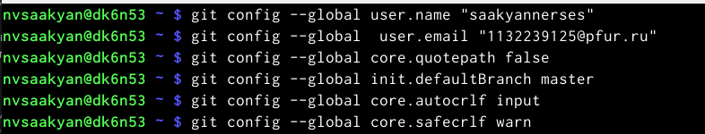{#fig:001 width=70%}

## Создаём ключ SSH и GPG.

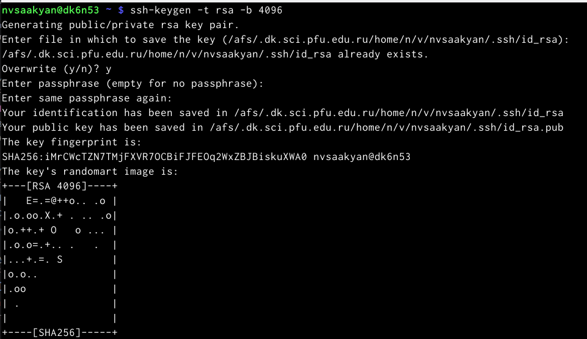{ #fig:002 width=70% }
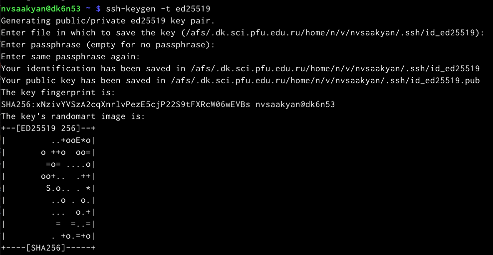{ #fig:003 width=70% }

## Ключ нужно добавить на github. Для этого переходим на сайте в раздел “Settings” и выбираем “SSH and GPG keys”.

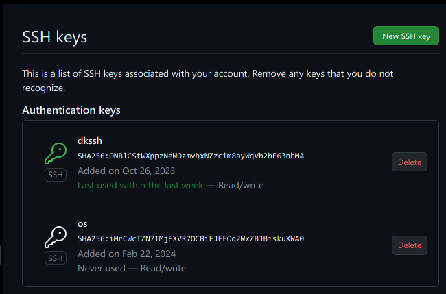{ #fig:004 width=70% }
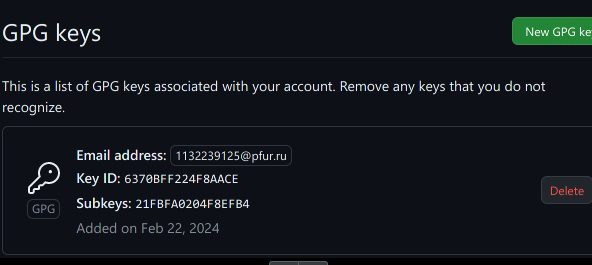{ #fig:005 width=70% }

## Выводим список ключей и копируем отпечаток приватного ключа

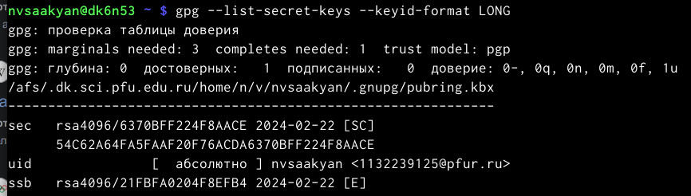{ #fig:006 width=70% }

## Настройка автоматических подписей коммитов git

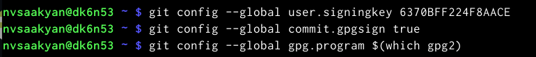{ #fig:007 width=70% }

## Возвращаемся в наш терминал и настраиваем gh.

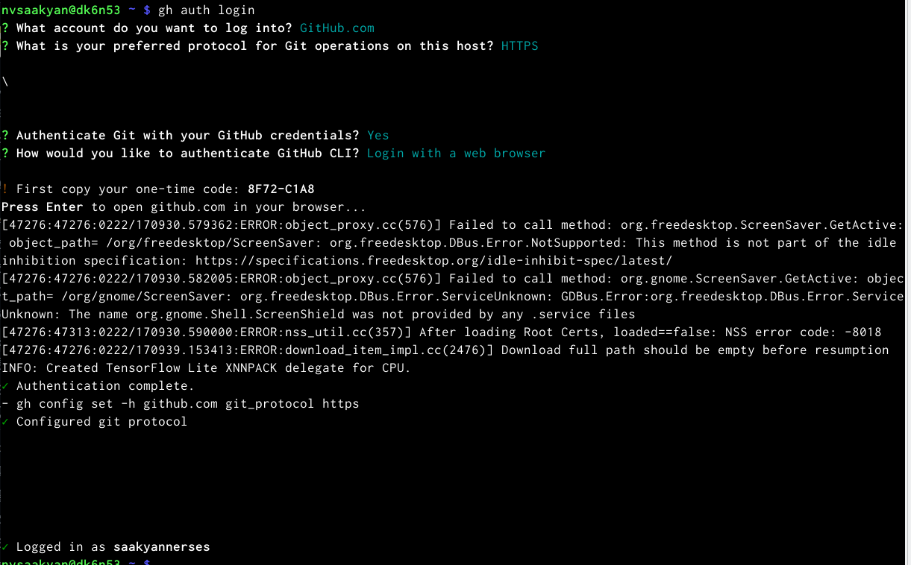{ #fig:008 width=70% }

## Создаём репозиторий курса на основе шаблона.

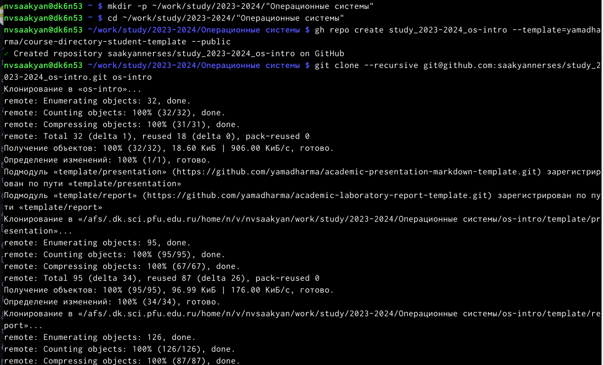{ #fig:009 width=70% }

## Настраиваем каталог курса.

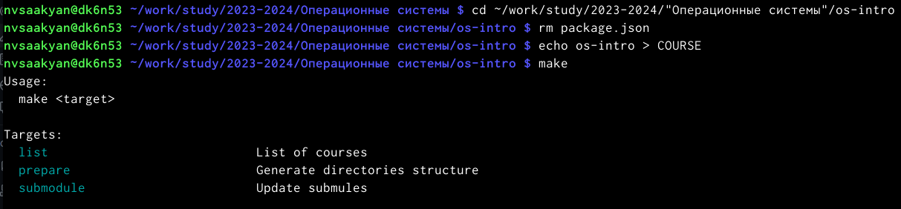{ #fig:010 width=70% }

## Создаём необходимые каталоги и отправляем наши файлы на сервер	

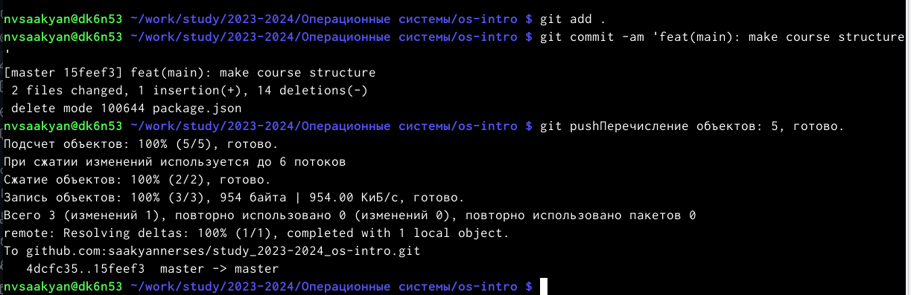{ #fig:011 width=70% }

## Вывод

В ходе выполнения лабораторной работы изучили идеологию и применение средств контроля версий, а также освоили умения по работе с git.

