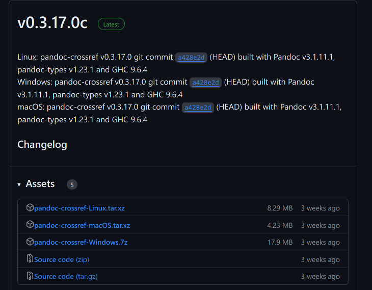
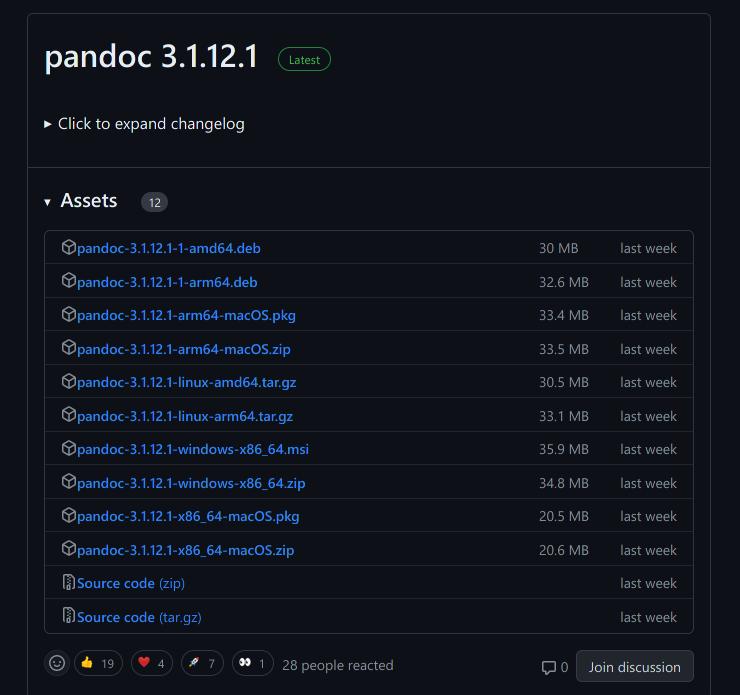
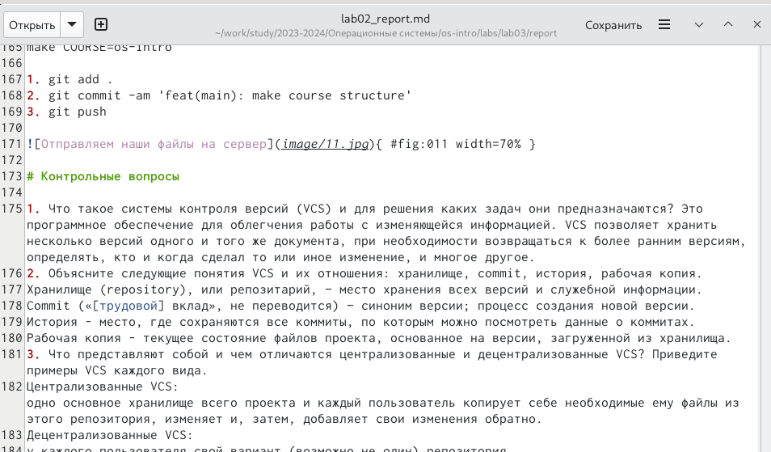
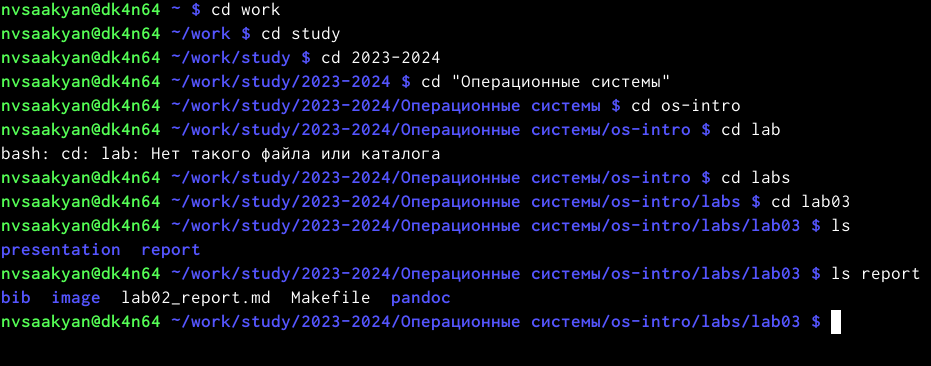
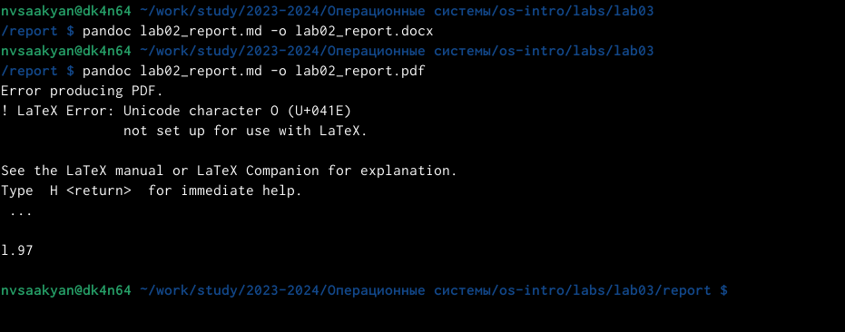
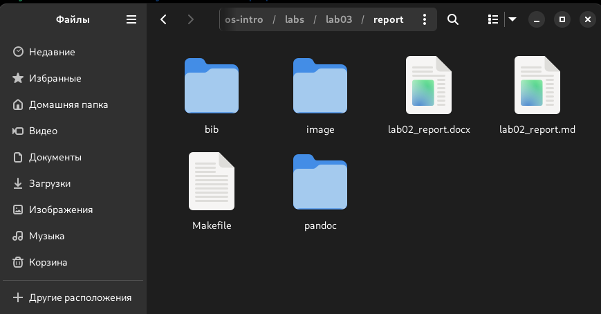

---
## Front matter
lang: ru-RU
title: Лабораторная работа №3.
subtitle: 
author:
  - Карапетян Мари Рафаеловна
institute:
  - Российский университет дружбы народов, Москва, Россия
date: 22 февраля 2024

## Formatting
mainfont: PT Serif
romanfont: PT Serif
sansfont: PT Sans
monofont: PT Mono
toc: false
slide_level: 2
theme: metropolis
header-includes:
- \metroset{progressbar=frametitle,sectionpage=progressbar, numbering=fraction}
- '\makeatletter'
- '\beamer@ignorenonframefalse'
- '\makeatother'
aspectratio: 43
section-titles: true

---

# Цели и задачи работы

## Цели и задачи

Научиться оформлять отчёты с помощью легковесного языка разметки Markdown.

# Процесс выполнения лабораторной работы

## Для обработки файлов в формате Markdown скачаем pandoc, pandoc-citeproc и pandoc-crossref

{ #fig:001 width=70% }
{ #fig:002 width=70% }

## Изменение шаблона для лабораторной работы № 2

{ #fig:003 width=70% }

## Переход в каталог report в терминале

{ #fig:004 width=70% }

## Конвертируем наш файл в формате Markdown в pdf и docx.

{ #fig:005 width=70% }

## Проверяем выполнение данных команд, перейдя в нашу папку lab03, report 

{ #fig:006 width=70% }

## Выводы

В ходе выполнения лабораторной работы мы научились оформлять отчёты с помощью легковесного языка Markdown.
