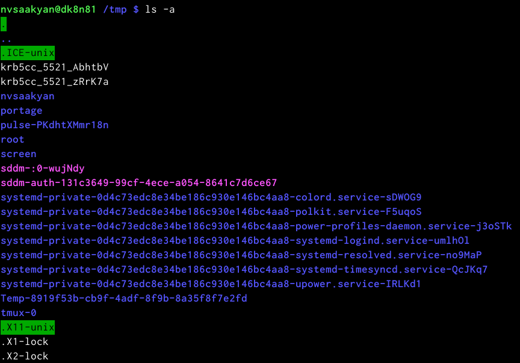
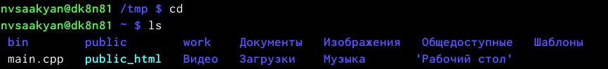
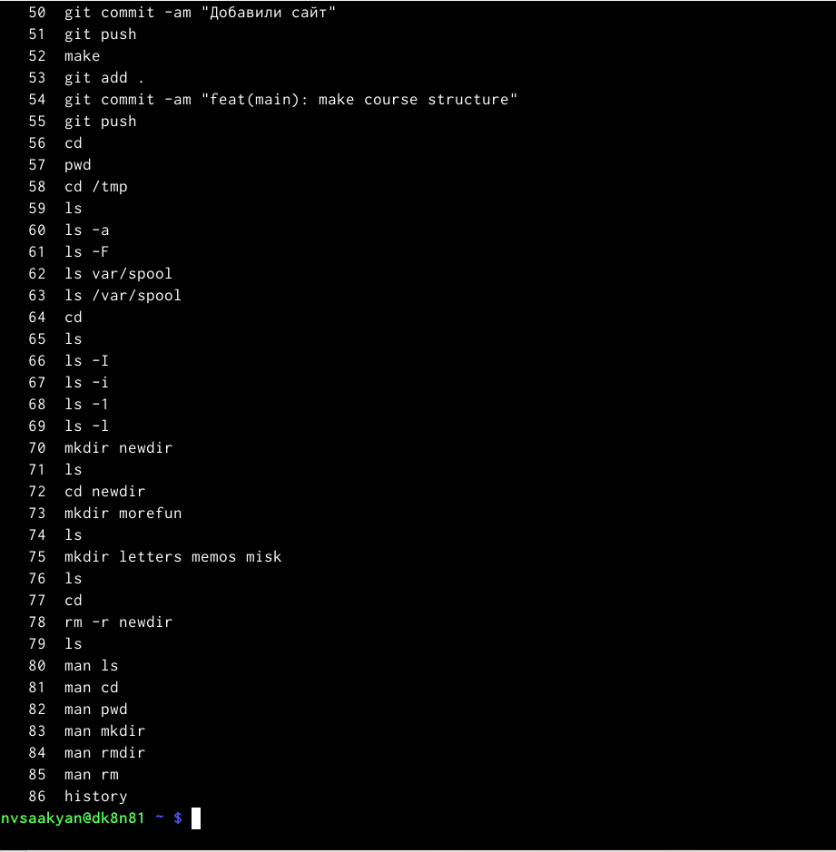

---
## Front matter
title: "Лабораторная работа №6"
subtitle: "Основы интерфейса взаимодействия
пользователя с системой Unix на уровне командной строки"
author: "Саакян Нерсес Варданович"

## Generic otions
lang: ru-RU
toc-title: "Содержание"

## Bibliography
bibliography: bib/cite.bib
csl: pandoc/csl/gost-r-7-0-5-2008-numeric.csl

## Pdf output format
toc: true # Table of contents
toc-depth: 2
lof: true # List of figures
lot: true # List of tables
fontsize: 12pt
linestretch: 1.5
papersize: a4
documentclass: scrreprt
## I18n polyglossia
polyglossia-lang:
  name: russian
  options:
	- spelling=modern
	- babelshorthands=true
polyglossia-otherlangs:
  name: english
## I18n babel
babel-lang: russian
babel-otherlangs: english
## Fonts
mainfont: PT Serif
romanfont: PT Serif
sansfont: PT Sans
monofont: PT Mono
mainfontoptions: Ligatures=TeX
romanfontoptions: Ligatures=TeX
sansfontoptions: Ligatures=TeX,Scale=MatchLowercase
monofontoptions: Scale=MatchLowercase,Scale=0.9
## Biblatex
biblatex: true
biblio-style: "gost-numeric"
biblatexoptions:
  - parentracker=true
  - backend=biber
  - hyperref=auto
  - language=auto
  - autolang=other*
  - citestyle=gost-numeric
## Pandoc-crossref LaTeX customization
figureTitle: "Рис."
tableTitle: "Таблица"
listingTitle: "Листинг"
lofTitle: "Список иллюстраций"
lotTitle: "Список таблиц"
lolTitle: "Листинги"
## Misc options
indent: true
header-includes:
  - \usepackage{indentfirst}
  - \usepackage{float} # keep figures where there are in the text
  - \floatplacement{figure}{H} # keep figures where there are in the text
---

# Цель работы

Приобретение практических навыков взаимодействия пользователя с системой по-
средством командной строки

# Задание

1. Определите полное имя вашего домашнего каталога. Далее относительно этого ката-
лога будут выполняться последующие упражнения.
2. Выполните следующие действия:
2.1. Перейдите в каталог /tmp.
2.2. Выведите на экран содержимое каталога /tmp. Для этого используйте команду ls
с различными опциями. Поясните разницу в выводимой на экран информации.
2.3. Определите, есть ли в каталоге /var/spool подкаталог с именем cron?
2.4. Перейдите в Ваш домашний каталог и выведите на экран его содержимое. Опре-
делите, кто является владельцем файлов и подкаталогов?
3. Выполните следующие действия:
3.1. В домашнем каталоге создайте новый каталог с именем newdir.
3.2. В каталоге ~/newdir создайте новый каталог с именем morefun.
3.3. В домашнем каталоге создайте одной командой три новых каталога с именами
letters, memos, misk. Затем удалите эти каталоги одной командой.
3.4. Попробуйте удалить ранее созданный каталог ~/newdir командой rm. Проверьте,
был ли каталог удалён.
3.5. Удалите каталог ~/newdir/morefun из домашнего каталога. Проверьте, был ли
каталог удалён.
4. С помощью команды man определите, какую опцию команды ls нужно использо-
вать для просмотра содержимое не только указанного каталога, но и подкаталогов,
входящих в него.
5. С помощью команды man определите набор опций команды ls, позволяющий отсорти-
ровать по времени последнего изменения выводимый список содержимого каталога
с развёрнутым описанием файлов.
6. Используйте команду man для просмотра описания следующих команд: cd, pwd, mkdir,
rmdir, rm. Поясните основные опции этих команд.
7. Используя информацию, полученную при помощи команды history, выполните мо-
дификацию и исполнение нескольких команд из буфера команд.

# Теоретическое введение
Команда man. Команда man используется для просмотра (оперативная помощь) в диа-
логовом режиме руководства (manual) по основным командам операционной системы
типа Linux.

Команда cd. Команда cd используется для перемещения по файловой системе опера-
ционной системы типа Linux.

Команда pwd. Для определения абсолютного пути к текущему каталогу используется
команда pwd (print working directory).

Команда ls. Команда ls используется для просмотра содержимого каталога.

Команда mkdir. Команда mkdir используется для создания каталогов.

Команда rm. Команда rm используется для удаления файлов и/или каталогов.

Команда history. Для вывода на экран списка ранее выполненных команд исполь-
зуется команда history. Выводимые на экран команды в списке нумеруются. К любой
команде из выведенного на экран списка можно обратиться по её номеру в списке,
воспользовавшись конструкцией !<номер_команды>.

# Выполнение лабораторной работы

1. Определим полное имя вашего домашнего каталога. Далее относительно этого ката-
лога будут выполняться последующие упражнения.

{#fig:001 width=70%}

2. Выполним следующие действия:
    2.1 Перейдём в каталог /tmp

{#fig:002 width=70%}

    2.2 Выведем на экран содержимое каталога /tmp с помощью команды ls

{#fig:003 width=70%}
    
    Сравним команды ls -a и ls -F

{#fig:004 width=70%}

{#fig:005 width=70%}

ls -a - отображает имена скрытых файлов
ls -F - даёт информацию о типах файлов 

    2.3 Определим, есть ли в каталоге /var/spool подкаталог с именем cron

{#fig:006 width=70%}

    2.4 Переходим в домашний каталог и выводим на экран его содержимое. 

{#fig:007 width=70%}
    Определим, кто является владельцем файлов и подкаталогов с помоью команды ls -l

{#fig:008 width=70%}

3. Выполним следующие действия: 

    3.1. В домашнем каталоге создаём новый каталог с именем newdir.

{#fig:009 width=70%}

    3.2  В каталоге ~/newdir создаём новый каталог с именем morefun.

{#fig:010 width=70%}

    3.3 В домашнем каталоге создаём одной командой три новых каталога с именами
letters, memos, misk. Затем удаляем эти каталоги одной командой

{#fig:011 width=70%}
    

4. С помощью команды man определяем, какую опцию команды ls нужно использо-
вать для просмотра содержимого не только указанного каталога, но и подкаталогов,
входящих в него.
    
{#fig:012 width=70%}

{#fig:013 width=70%}

Нужно использовать команду ls -R

5. С помощью команды man определяем набор опций команды ls, позволяющий отсорти-
ровать по времени последнего изменения выводимый список содержимого каталога
с развёрнутым описанием файлов.

{#fig:014 width=70%}

6. Используйте команду man для просмотра описания следующих команд: cd, pwd, mkdir,
rmdir, rm. Поясните основные опции этих команд.

{#fig:015 width=70%}

{#fig:016 width=70%}

{#fig:017 width=70%}

{#fig:018 width=70%}

{#fig:019 width=70%}

7.Получим при помощи команды history

{#fig:020 width=70%}

{#fig:021 width=70%}

    Выполним модификацию и исполнение нескольких команд из буфера команд
    
{#fig:022 width=70%}

{#fig:023 width=70%}

# Контрольные вопросы
1. Что такое командная строка?
В операционной системе типа Linux взаимодействие пользователя с системой обычно
осуществляется с помощью командной строки посредством построчного ввода ко-
манд.
2. При помощи какой команды можно определить абсолютный путь текущего каталога?
Приведите пример.
Для определения абсолютного пути к текущему каталогу используется
команда pwd (print working directory).
Пример (абсолютное имя текущего каталога пользователя dharma):
- pwd
результат:
- /afs/dk.sci.pfu.edu.ru/home/d/h/dharma
3. При помощи какой команды и каких опций можно определить только тип файлов
и их имена в текущем каталоге? Приведите примеры.
ls -F
4. Каким образом отобразить информацию о скрытых файлах? Приведите примеры.
Имена таких файлов начинаются с точки. Для
того, чтобы отобразить имена скрытых файлов, необходимо использовать команду ls
с опцией a:
- ls -a
5. При помощи каких команд можно удалить файл и каталог? Можно ли это сделать
одной и той же командой? Приведите примеры.
rm b rmdir. rm для удаления файлов и каталогов, но если каталог не пустой, нужно использовать опцию -r.
6. Каким образом можно вывести информацию о последних выполненных пользовате-
лем командах? работы?
Для вывода на экран списка ранее выполненных команд исполь-
зуется команда history.
7. Как воспользоваться историей команд для их модифицированного выполнения? При-
ведите примеры.
Выводимые на экран команды в списке нумеруются. К любой
команде из выведенного на экран списка можно обратиться по её номеру в списке,
воспользовавшись конструкцией !<номер_команды>.
Пример:
history
1 ls -a
2 cd
3 pwd ....
 !3:s/a/F
 ls -F
8. Приведите примеры запуска нескольких команд в одной строке.
Если требуется выполнить последовательно несколько
команд, записанный в одной строке, то для этого используется символ точка с запятой
cd;pwd
9. Дайте определение и приведите примера символов экранирования.
Если в заданном контексте встречаются специальные символы (типа «.»,
«/», «*» и т.д.), надо перед ними поставить символ экранирования \ (обратный слэш).
10. Охарактеризуйте вывод информации на экран после выполнения команды ls с опцией
l.
Опция l используется для вывода на экран подробной информации о файлах и каталогах. При этом о каждом файле и каталоге будет выведена следующая
информация:
– тип файла,
– право доступа,
– число ссылок,
– владелец,
– размер,
– дата последней ревизии,
– имя файла или каталога.
11. Что такое относительный путь к файлу? Приведите примеры использования относи-
тельного и абсолютного пути при выполнении какой-либо команды.
12. Как получить информацию об интересующей вас команде?
С помощью команды man. например команда man pwd выведет опции команды pwd.
13. Какая клавиша или комбинация клавиш служит для автоматического дополнения
вводимых команд?

# Выводы

Мы приобрели практические навыки взаимодействия пользователя с системой по-
средством командной строки.

