---
## Front matter
lang: ru-RU
title: "Отчет о выполнении индивидуального проекта.Этап 1."
subtitle: 
author:
  - Саакян Нерсес Варданович
institute:
  - Российский университет дружбы народов, Москва, Россия
date: 22 февраля 2024

## Formatting
mainfont: PT Serif
romanfont: PT Serif
sansfont: PT Sans
monofont: PT Mono
toc: false
slide_level: 2
theme: metropolis
header-includes:
- \metroset{progressbar=frametitle,sectionpage=progressbar, numbering=fraction}
- '\makeatletter'
- '\beamer@ignorenonframefalse'
- '\makeatother'
aspectratio: 43
section-titles: true

---

# Цели и задачи работы

## Цели и задачи

Размещение на Github pages заготовки для персонального сайта.
Установить необходимое программное обеспечение.
    Скачать шаблон темы сайта.
    Разместить его на хостинге git.
    Установить параметр для URLs сайта.
    Разместить заготовку сайта на Github pages.

# Процесс выполнения индивидуального проекта

## Скачиваем hugo exstending.Создаем папку bin и вставляем файл hugo.

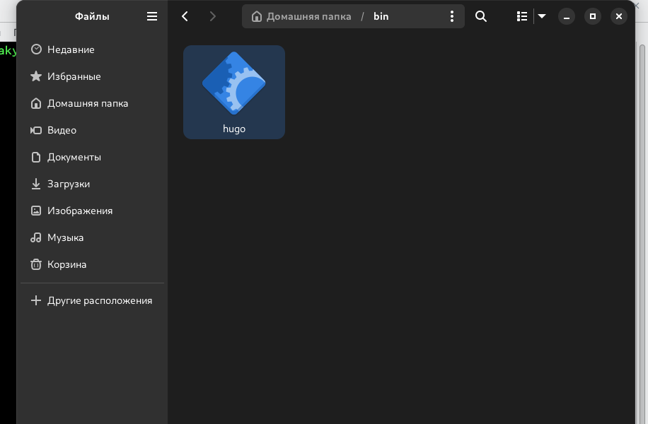{#fig:001 width=70%}

## Создаем репозиторий blog 

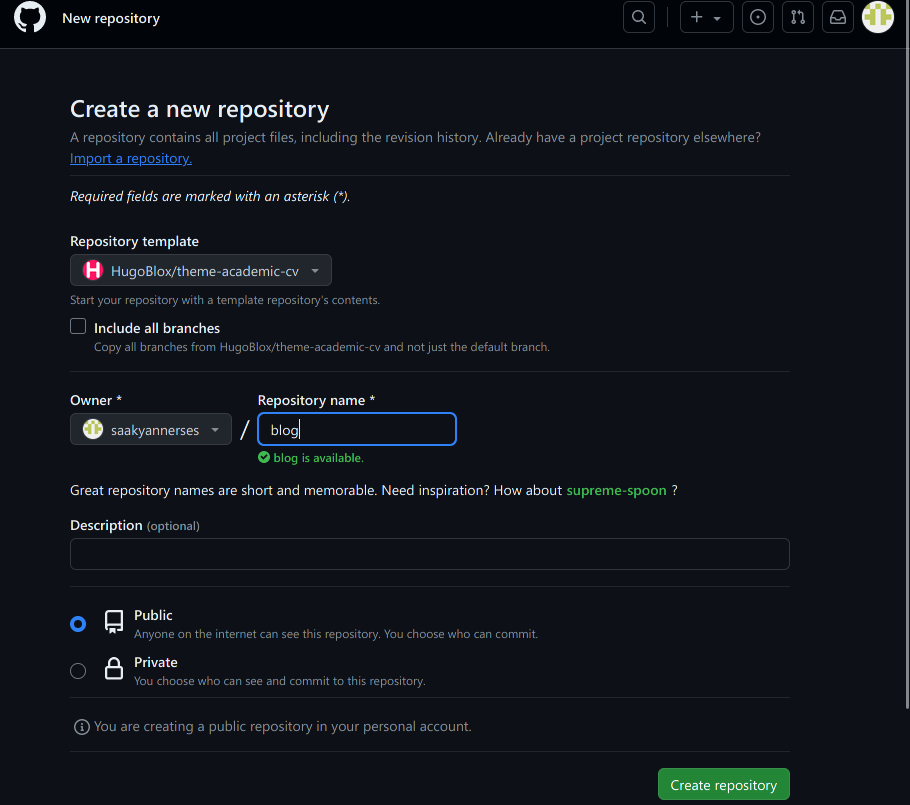{#fig:002 width=70%}

## Клонируем репозиторий blog 

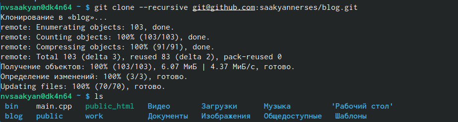{#fig:003 width=70%}

## Перейдем в blog и выполним команду ~/bin/hugo server.Проверяем папку 

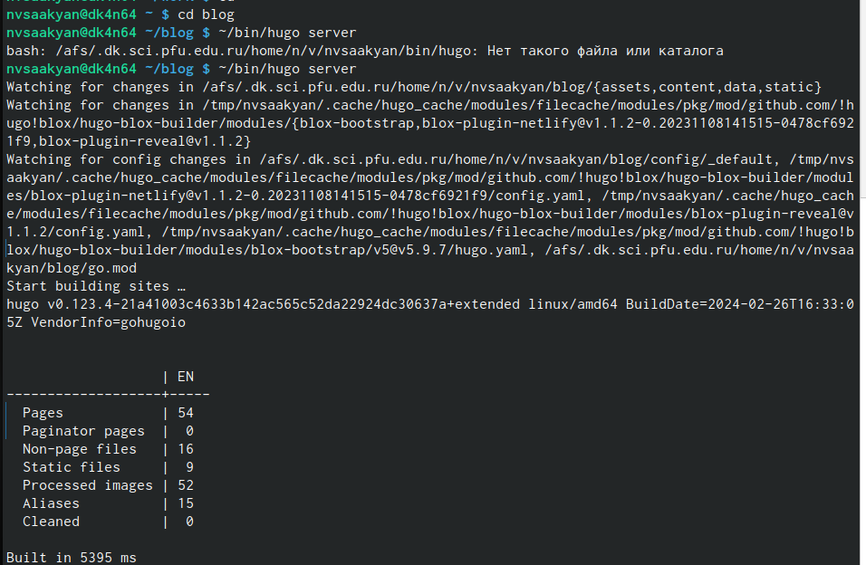{#fig:004 width=70%}

## Удаляем папку public

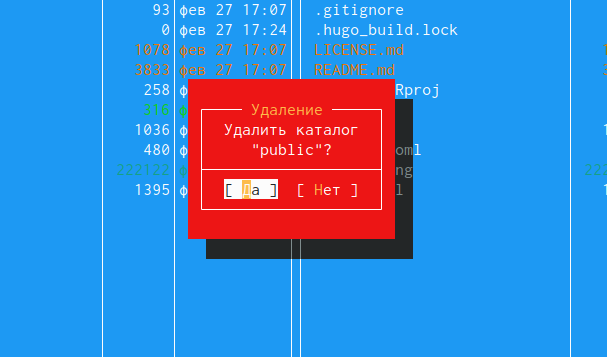{#fig:005 width=70%}

##

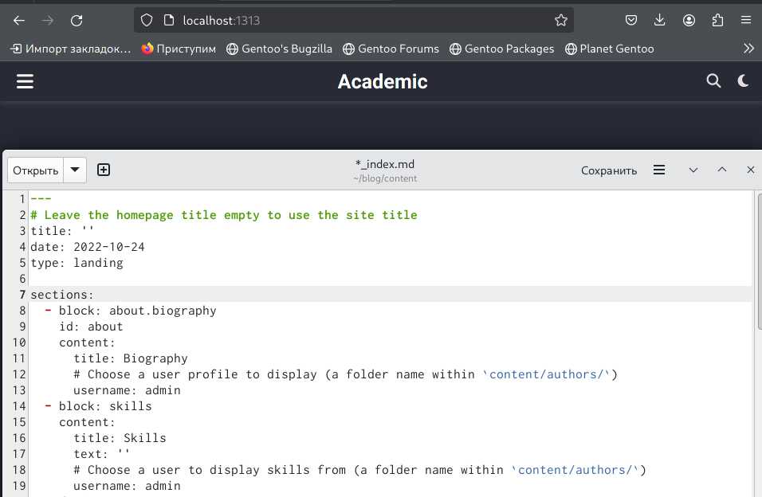{#fig:006 width=70%}

## Выполним команду ~/bin/hugo server переходим по ссылке localhost и уберем шапку сайта.Перейдем для этого в папку content и отредактируем файл index.md

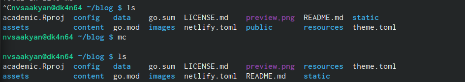{#fig:007 width=70%}

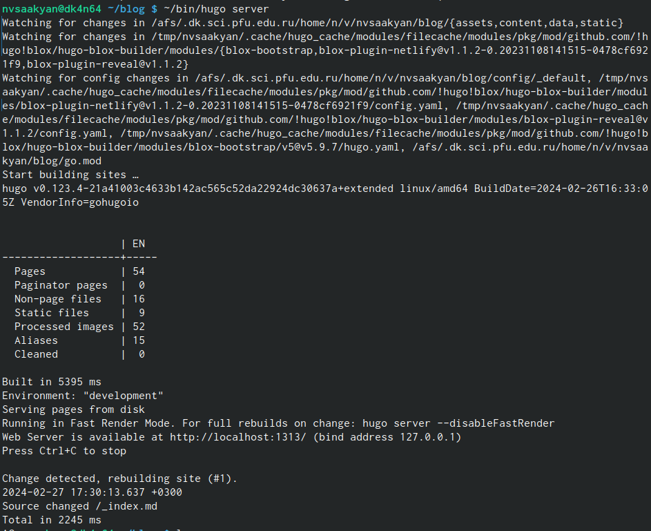{#fig:008 width=70%}

## Создаем новый репозиторий 

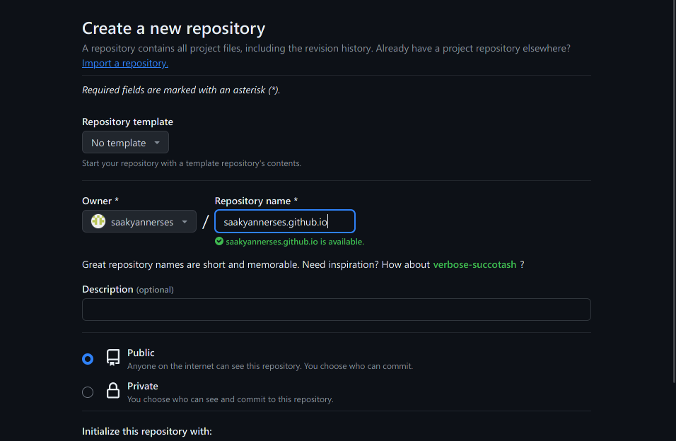{#fig:009 width=70%}

## Клонируем репозиторий mkarapaaa.github.io

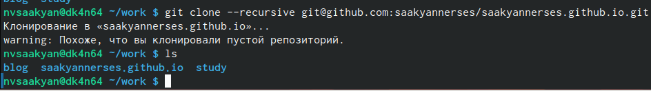{#fig:010 width=70%}

## Подключим ветку main

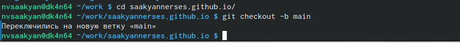{#fig:011 width=70%}

## Создадим пустой файл REDME.md 

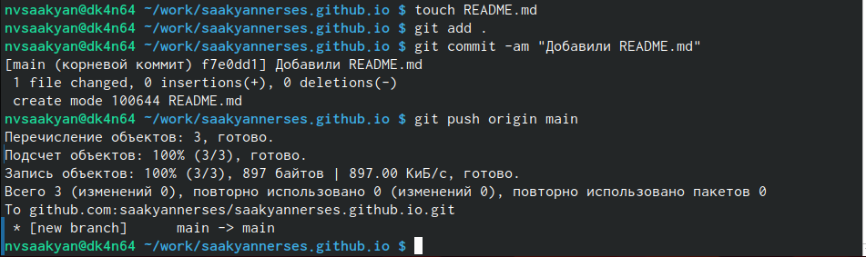{#fig:012 width=70%}

## Перейдем в файл .gitignore и отредактируем

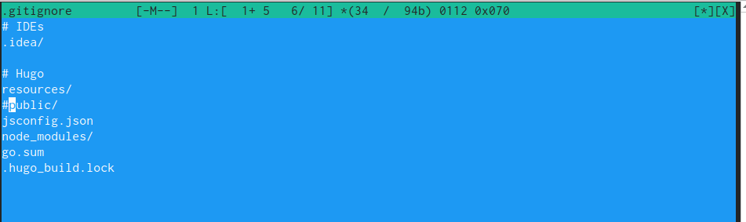{#fig:013 width=70%}

## Введем команду submodule

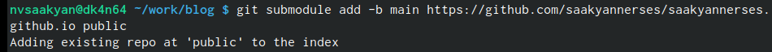{#fig:014 width=70%}

## Наполним папку public, используя команду ~/bin/hugo 

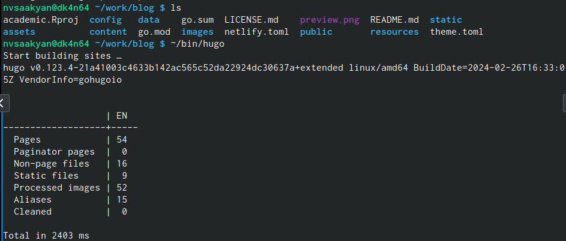{#fig:015 width=70%}

## Перейдем в папку public,проверим,отправим все на github.

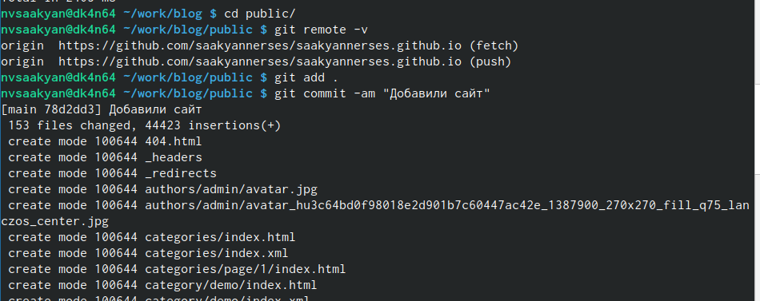{#fig:016 width=70%}

## Проверим наш сайт

{#fig:017 width=70%}

## Выводы

Размещение на Github pages заготовки для персонального сайта.
