---
## Front matter
lang: ru-RU
title: "Отчет о выполнении индивидуального проекта.Этап 2."
subtitle: 
author:
  - Саакян Нерсес Варданович
institute:
  - Российский университет дружбы народов, Москва, Россия
date: 22 февраля 2024

## Formatting
mainfont: PT Serif
romanfont: PT Serif
sansfont: PT Sans
monofont: PT Mono
toc: false
slide_level: 2
theme: metropolis
header-includes:
- \metroset{progressbar=frametitle,sectionpage=progressbar, numbering=fraction}
- '\makeatletter'
- '\beamer@ignorenonframefalse'
- '\makeatother'
aspectratio: 43
section-titles: true

---

# Цели и задачи работы

## Цели и задачи

Разместить фотографию владельца сайта.
Разместить краткое описание владельца сайта.
Добавить информацию об интересах.
Добавить информацию об образовании.
Сделать пост по прошедшей неделе.
Добавить пост на тему: "Управление версиями.Git."

# Процесс выполнения индивидуального проекта

## Добавление фотографии на сайт

Путь к фотографии: "work", "blog", "content", "authors", "admin".

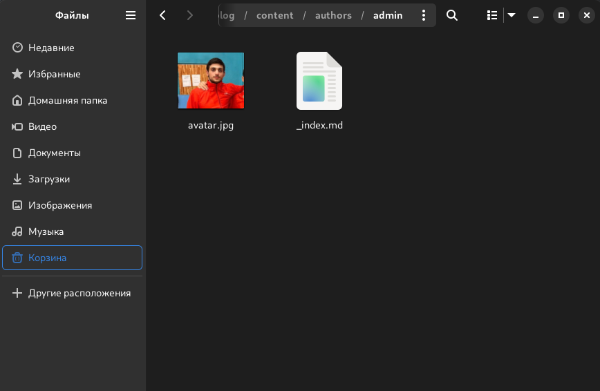{ #fig:001 width=100% }

## Добавление информации о себе

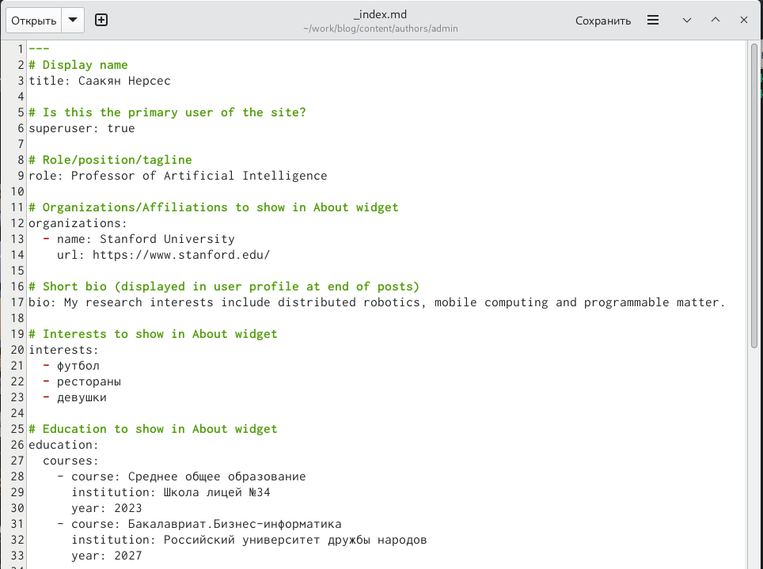{ #fig:002 width=100% }

## Создание постов

Каталог "blog". Команда: hugo new --kind post post/(название поста).

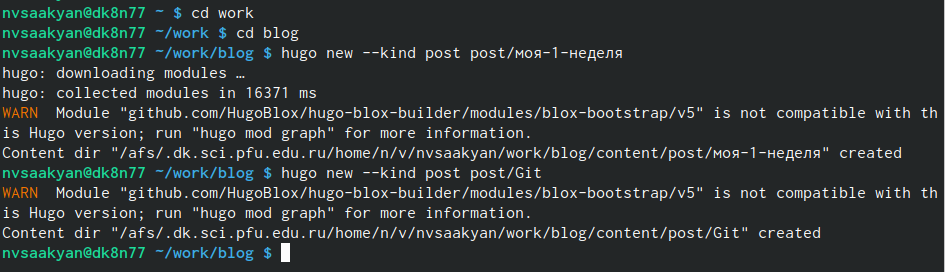{ #fig:003 width=100% }

## Проверка создания постов

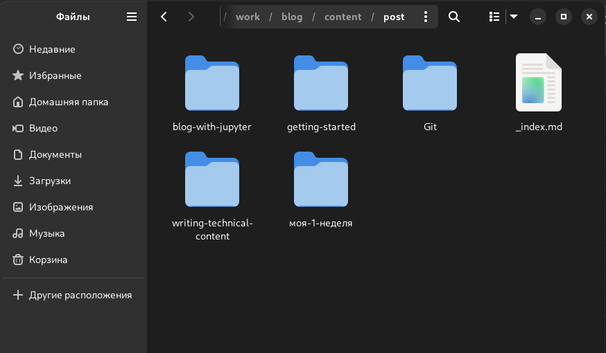{ #fig:004 width=100% }

## Внесение информации для поста

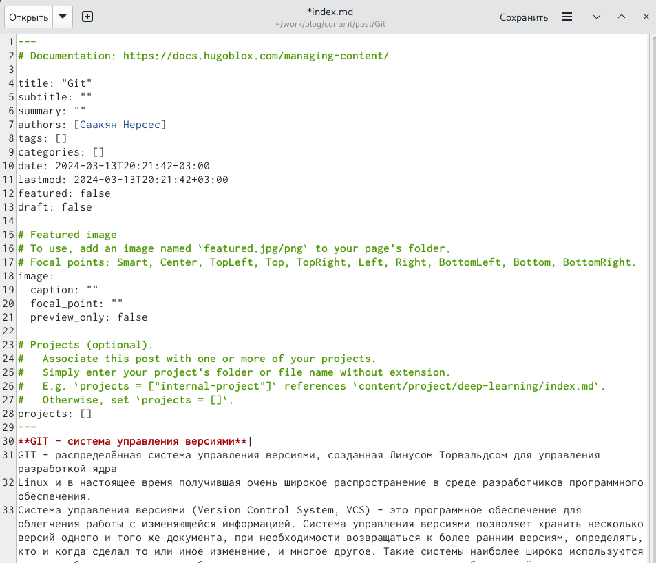{ #fig:005 width=100% }

## Внесение информации для поста

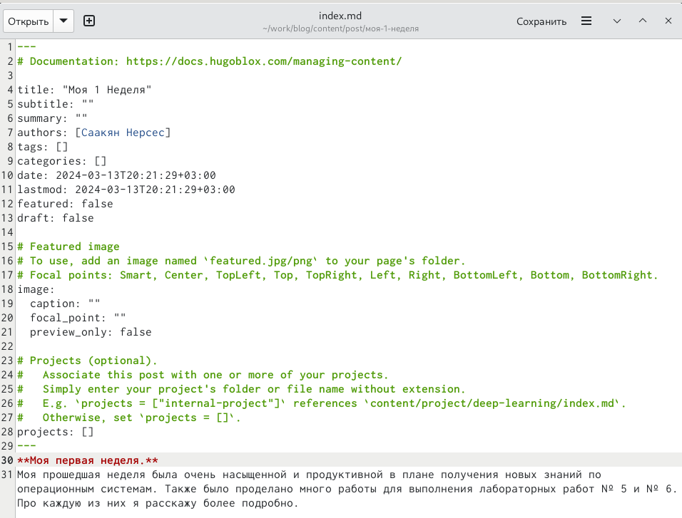{ #fig:006 width=100% }

## Запуск команды hugo

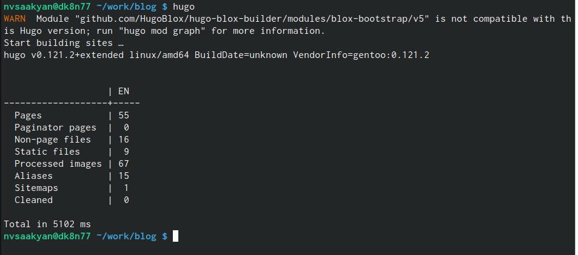{ #fig:007 width=100% }

## Выгрузка на github

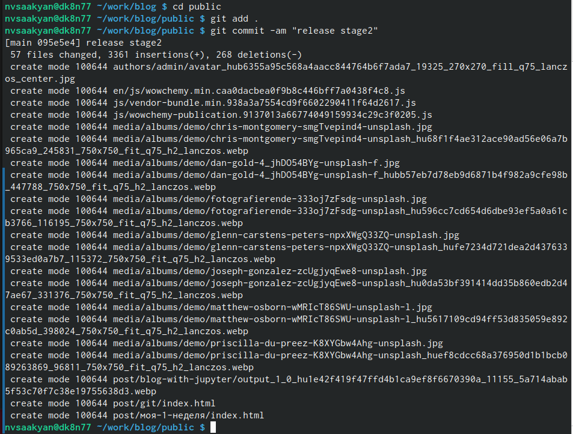{ #fig:008 width=100% }

## Выгрузка на github
	
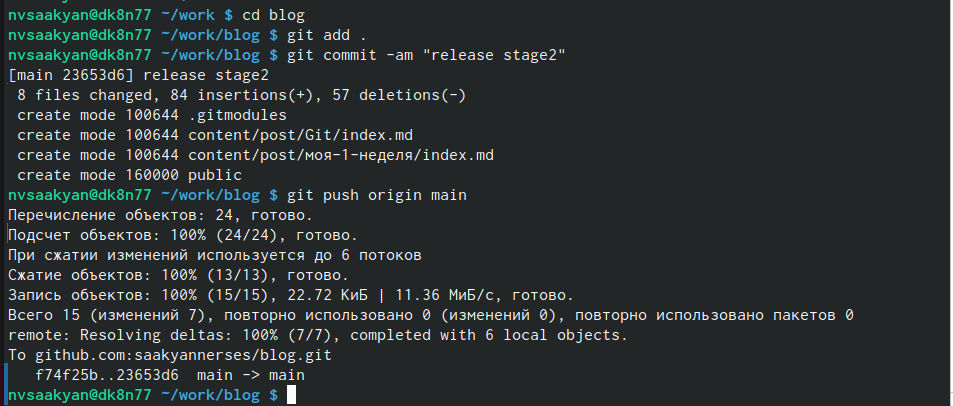{ #fig:009 width=70% }

## Просмотр изменений на сайте

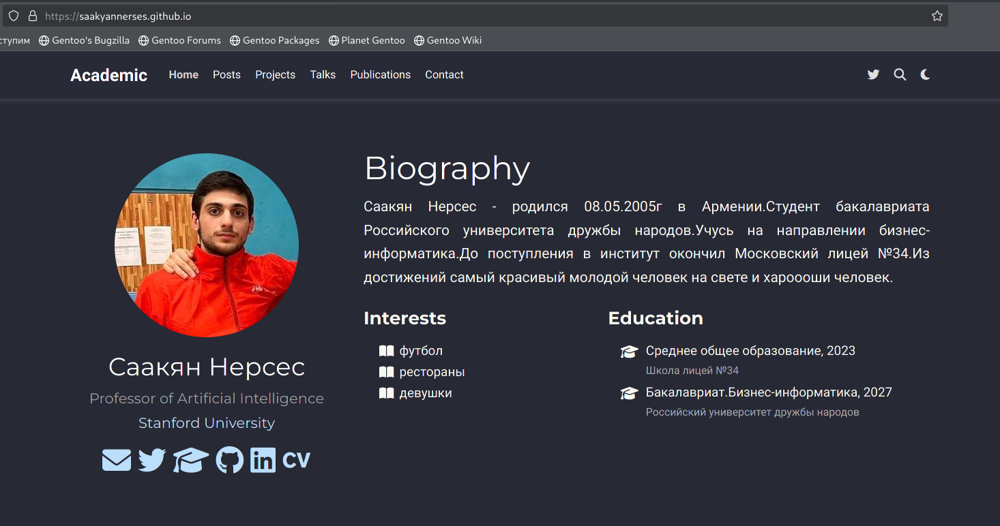{ #fig:010 width=100% }

## Просмотр изменений на сайте

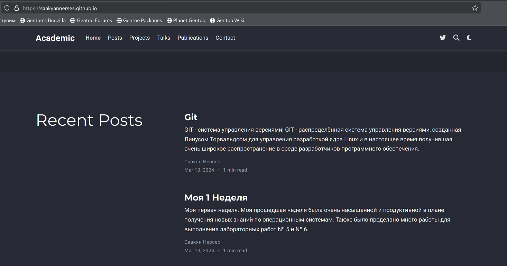{ #fig:011 width=100% }

# Выводы

В ходе выполнения второго этапа индивидуального проекта мы научились добавлять к сайту информацию о себе, а также создавать новые посты.

